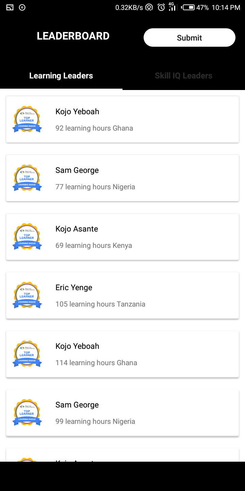
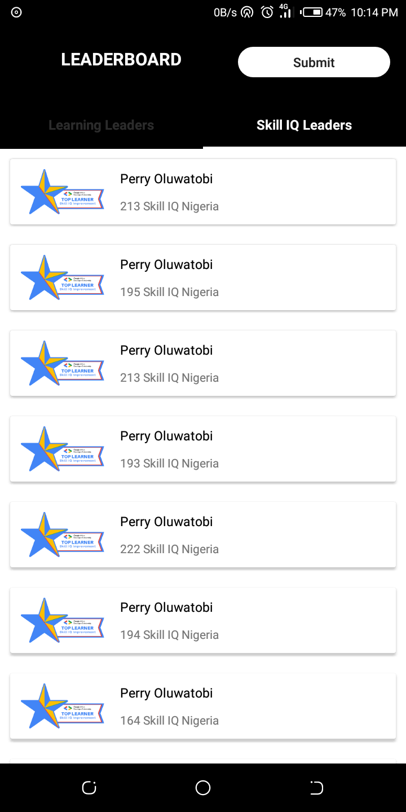
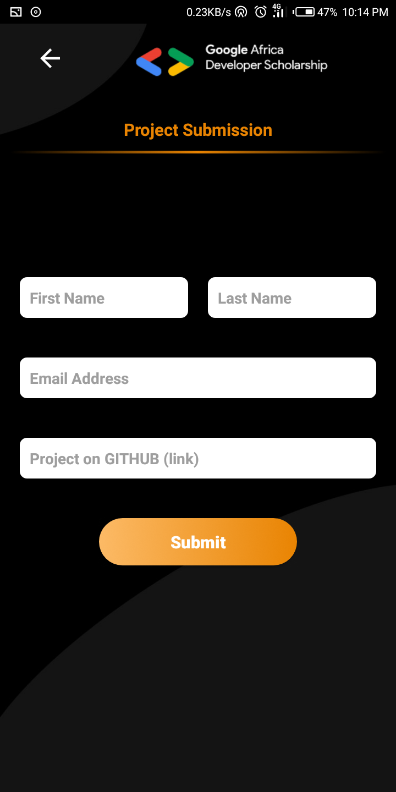
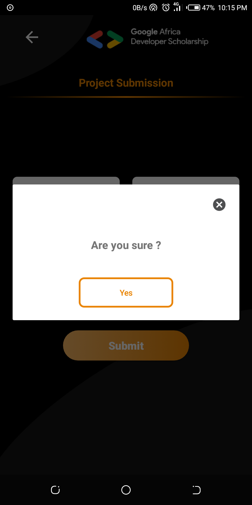
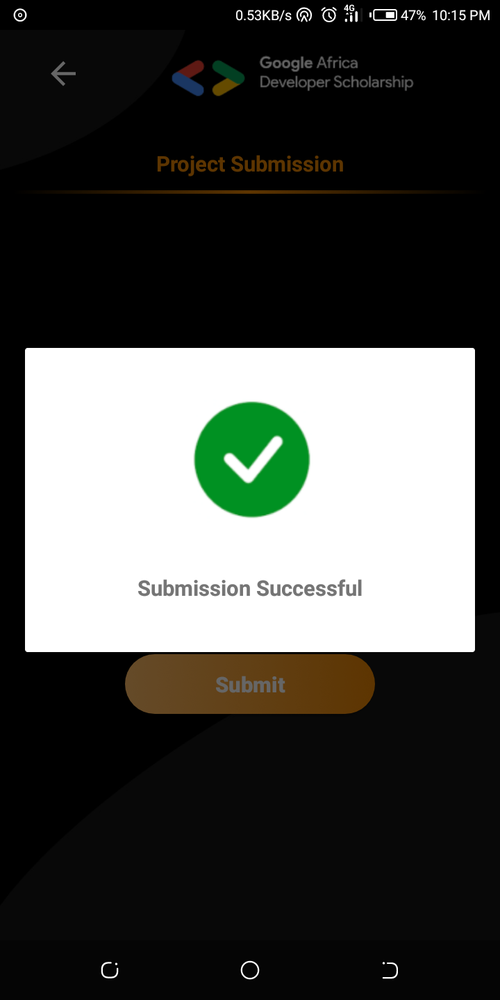

# GADS

## Android practice application

## Third party libraries
- [Retrofit](https://square.github.io/retrofit) - This is used to make Network calls.
- [GSON](https://github.com/google/gson) - It is used to convert my Java objects into JSON and with the help of the retrofit-converter it does the vice versa
- [koin](https://insert-koin.io/) - Dependency injection is executed by this Kotlin DSL

## Screenshots
| Splash Screen                     | Learning leaders page               | Skills IQ leaders                 |
|-----------------------------------|-------------------------------------|-----------------------------------|
|  ||  |

| Submit page                       | Confirmation dialog                 | Success dialog                    |
|-----------------------------------|-------------------------------------|-----------------------------------|
|  |  ||

## [APK](https://bit.ly/2FoWX30)
